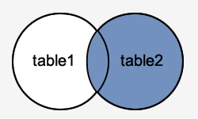
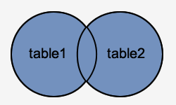

#### About  

This are my notes taken while mostly doing;  
1. https://selectstarsql.com/  and also;   
2. https://sqlbolt.com/    
3. https://www.techonthenet.com/postgresql/joins.php    
4. http://sqlfiddle.com   


connect to the db like;   
```sh
export PGPASSFILE=.pgpass && psql --host=localhost --port=5432 --username=myuser --dbname=myDBname
```

Note:
1. the commands in here can be ran via psql 
```sql
psql -U "${POSTGRES_USER}" "${POSTGRES_DB}" -c "CREATE blah blah;"
```
In fact, you can add the command to a bash file that will then be ran at postgres start
see: https://github.com/timescale/timescaledb-docker/blob/681ec4cb7fdc89b126df8eafe983c8db1a143df0/Dockerfile#L8-L9

2. sql formatting is via: https://github.com/darold/pgFormatter

1. create db
```sql
/* u can query to see existing databases
select * from pg_database; */
CREATE DATABASE myDBname TEMPLATE template1 ENCODING UTF8;
```

2. create extension
```sql
CREATE EXTENSION IF NOT EXISTS timescaledb CASCADE;
```

3. create table
```sql
CREATE TABLE IF NOT EXISTS myTableName (
    /* constraint names appear in error msgs. */
    time TIMESTAMPTZ CONSTRAINT "constraintName time cant be null" NOT NULL,
    trace_id varchar(40) UNIQUE NOT NULL,
    data JSONB NULL,
    /* The CHECK clause specifies an expression producing a Boolean result. */
    age integer CHECK (age > 0),
    PRIMARY KEY (time, trace_id)
);

CREATE TABLE IF NOT EXISTS alasTable (
    /* PRIMARY KEY says that a column/s can contain ONLY unique (non-duplicate), non-NULL values */
    trace_id varchar(40) PRIMARY KEY
);

CREATE TABLE IF NOT EXISTS okayTable (
        my_id varchar(40),
        /*
        Foreign key is a field/s in a table that uniquely identifies a row in another table.
        What happens to rows in okayTable if a row in alasTable is deleted?
        ON DELETE CASCADE deletes rows in okayTable if corresponding ones in alasTable are deleted.
        theres also an "ON UPDATE action" for what to do to rows on update.
        Note that "my_id" and "trace_id" need to have the same data type
        */
        FOREIGN KEY (my_id) REFERENCES alasTable (trace_id) ON DELETE CASCADE
);

CREATE TABLE IF NOT EXISTS logs (
    time TIMESTAMPTZ NOT NULL,
    application_name TEXT NOT NULL,
    environment_name TEXT NOT NULL,
    log_event TEXT NOT NULL,
    trace_id TEXT NOT NULL,
    file_path TEXT NOT NULL,
    host_ip TEXT NOT NULL,
    data JSONB NULL,
    PRIMARY KEY (time, trace_id)
);


CREATE TABLE IF NOT EXISTS executions (
     first_name	varchar(140),
     last_name	varchar(140),
     ex_number	smallint,
     ex_age	smallint,
     ex_date	date,
     county	varchar(80),
     last_statement text
);
```
The list of postgres data types is at: https://www.postgresql.org/docs/11/datatype.html

4. create index 
```sql
/* we use DESC so that the most recent appear first.
You can create different kind of indices: btree, hash, gist, spgist, gin, and brin 
The default one is btree, gin index may be good for JSONB data 
see: https://www.postgresql.org/docs/current/datatype-json.html#JSON-INDEXING
you should prefer JSONB over json
 */
CREATE INDEX CONCURRENTLY IF NOT EXISTS myTimeIdexName ON logs (time DESC)
WHERE
    log_event IS NOT NULL AND time IS NOT NULL;

CREATE INDEX CONCURRENTLY IF NOT EXISTS myJsonDataIndexName ON logs
    USING GIN (data)
WHERE
    data IS NOT NULL;
```

```sql
/*
if your csv has a HEADER line, it is important to add WITH (HEADER)
otherwise you'll get errors lik; invalid input syntax for integer
*/
COPY executions (ex_number,last_name,first_name,ex_age,ex_date,county,last_statement) FROM '/usr/src/app/tx_deathrow_full.csv' WITH (FORMAT csv, HEADER);
```


## chapter 1: Beazley last statement(selecting)
The way select works is like;
```sql
/* 
multi-line comment
*/
-- single-line comment.
SELECT * FROM executions LIMIT 3;
```
```sql
SELECT <column>, <column>, ....
```
```sql
SELECT 50 /2, 51 / 2.0;
/*
SQL does integer division by default. Unless one of the numbers is a float.
returns:
?column? |      ?column?
----------+---------------------
       25 | 25.5000000000000000
*/
```

```sql
/* 
the synatx of the WHERE block is;
  WHERE <clause>
wherein <clause> refers to a Boolean statement
that the computer can evaluate to be true or false 
*/
select first_name, last_name 
from executions
where ex_age <= 25;
/*
in this example we found all inmates who were age 25 or younger
at the time of their execution.
NB: it is <= but not =<
*/
```

```sql
/*
there is also a LIKE <clause>. This allows us to use 
wildcards such as % and _ to match characters. 

'%roy' will return true for rows with first names ‘roy’, ‘Troy’, and ‘Deroy’ but not ‘royman’.
the `_` wildcard on the other hand matches only a single character.
*/
SELECT first_name, last_name, ex_number
FROM executions
WHERE first_name LIKE '_ay____';
/*
returns:
 first_name |  last_name  | ex_number
------------+-------------+-----------
 Gayland    | Bradford    |       468
 Raymond    | Landry, Sr. |        29
 Raymond    | Jones       |       186
 Raymond    | Kinnamon    |        85

ie; first_names that start with ANY character followed by `ay` followed by any OTHER four characters.
*/
```

```sql
/*
complex <clauses> can be made out of simple ones using Boolean operators like NOT, AND and OR.
SQL gives most precedence to NOT and then AND and finally OR. 
You can use parantheses to clarify the order that u want.
*/
SELECT last_statement
FROM executions
WHERE first_name = 'Napoleon'
AND last_name = 'Beazley';
/*
that query returns Beazley's last statement
*/
```

## chapter 2: claims of innocennce(aggregate funcs)
```sql
/*
to find the count of inmates who didnt provide a last_statement
*/
select count(*)
from executions
where last_statement is not null;
/*
you do not use equality operators(=,<) for null.
instead u use is null, or is not null
*/
```

```sql
SELECT COUNT(*) FROM executions;
/*
this finds the total number of executions
*/
```

```sql
/* min, max, avg age of exuctions*/
SELECT MIN(ex_age), MAX(ex_age), AVG(ex_age)
FROM executions;
```

```sql
/*
99th percentile age of execution
*/
SELECT percentile_disc(0.99) 
WITHIN GROUP (ORDER BY ex_age) 
FROM executions;
```

```sql
/*
list all counties without dupliation
*/
SELECT DISTINCT county 
FROM executions;
```

```sql
CASE 
      WHEN condition_1  THEN result_1
     WHEN condition_2  THEN result_2
     [WHEN ...]
     [ELSE result_n]
END
/*
A CASE block is like an IF/THEN/ELSE clause in other programming languages.
each condition(condition_1, condition_2 etc) is an expression that returns a boolean value, either true or false.
If the condition evaluates to true, it returns the result which follows the condition, and all other CASE branches do not process at all.

If all conditions evaluate to false, the CASE expression will return the result in the ELSE(ie result_n) part. 
If you omit the ELSE clause, the CASE expression will return null.
*/
```

```sql
/*
find the number of inmates who were age 25 or lower at time of execution
and also the number of inmates who were age 25 or higher at time of execution
*/
SELECT
    SUM(
        CASE WHEN ex_age <= 25 THEN
            1
        ELSE
            0
        END) AS "young",
    SUM(
        CASE WHEN ex_age > 25 THEN
            1
        ELSE
            0
        END) AS "old"
FROM
    executions;
/*
returns;
 young | old
-------+-----
     6 | 547
*/
```


```sql
/*
find number of people who claimed to have been innocent in their last_statements
*/
select
   sum(
       case when last_statement like '%innocent%' then
           1
       else
           0
        end) as innocent
FROM
    executions;
/*
returns:
innocent
----------
       31
*/
```


```sql
/*
Find a count of all inmates
and also a count of inmates who claim to have been innocent.
We are multiplying by 1.0 so that we can be able to do float division later on.
*/
select
   sum(
       case when last_statement like '%innocent%' then
           1
       else
           0
        end) as innocent,
   count(
   *
   ) * 1.0 as all_inmates
FROM
    executions;
/*
returns:
 innocent | all_inmates
----------+-------------
       31 |       553.0
*/
```


```sql
/*
Find the proportion of inmates with claims of innocence in their last statements.
NB:
- we multiply by 1.0 so that we can be able to do float division later on.
- it is easier to do the division if the multipliation
is in the first part as opposed to been in the second part as in the prev sql query.
*/
select
   sum(
       case when last_statement like '%innocent%' then
           1
       else
           0
        end) * 1.0 
    /
    count(
        *
     ) as proportion_innocent
FROM
    executions;
/*
returns:
  proportion_innocent
------------------------
 0.05605786618444846293
*/
```


```sql
/*
percentage of inmates who claimed to be innocent in their last_statements.
*/
select
   (
       sum(
            case when last_statement like '%innocent%' then
                1
            else
                0
            end
        ) * 1.0 

        -- division
        /

        count(
            *
        )
    ) *100 as percent_innocent
FROM
    executions;
/*
returns:
    percent_innocent
------------------------
 5.60578661844484629300
*/
```


## chapter 3: the long tail.
**GROUP BY** allows us to split up the dataset and apply aggregate functions within each group, resulting in one row per group.  
It comes after the **WHERE** block.   
```sql
/*
execution counts by/per county

In the SELECT block, <expression> AS <alias> 
provides an alias that can be referred to later in the query. 
*/
SELECT
    county,
    COUNT(*) AS county_executions
FROM
    executions
GROUP BY
    county;
/*
returns:
    county    | county_executions 
--------------+-------------------
 Hamilton     |                 1
 Bowie        |                 5
*/
```

```sql
/*
number of executions(that did not have a last statement) from each county.
*/
SELECT
    county,
    last_statement IS NOT NULL AS has_last_statement,
    COUNT(*)
FROM
    executions
GROUP BY
    county,
    has_last_statement;
/*
returns:
county    | has_last_statement | count 
--------------+--------------------+-------
 Houston      | t                  |     1
 Bee          | t                  |     2
 Crockett     | t                  |     1
 Lubbock      | t                  |    12
*/
```


```sql
/*
Count the number of inmates aged 50 or older that were executed in each county.
*/
SELECT
    ex_age,
    ex_age >= 50 AS BooleanIsOlderThanFifty,
    count(*)
FROM
    executions
WHERE
    BooleanIsOlderThanFifty = true
GROUP BY
    county,
    BooleanIsOlderThanFifty;
/*
DOES NOT WORK.
you would think that the above will work, but it does not.
This is because the WHERE block is EVALUATED BEFORE the SELECT block.
So you cannot use things that are returned from select block in where block,
But YOU CAN use things returned from SELECT block in GROUP BY block.
*/
```

```sql
/*
CORRECT:
Count the number of inmates aged 50 or older that were executed in each county.
*/
SELECT
    county,
    COUNT(*)
FROM
    executions
WHERE
    ex_age >= 50
GROUP BY
    county;
```


```sql
/*
anantomy of an SQL query.
*/
SELECT
    column_name (s)
FROM
    table_name
WHERE
    condition
GROUP BY
    column_name (s)
HAVING
    condition
ORDER BY
    column_name (s);
```

```sql
/*
List the counties in which more than 2 inmates aged 50 or older have been executed.
*/
SELECT
    county,
    count(*) AS num_executions
FROM
    executions
WHERE
    ex_age >= 50
GROUP BY
    county
HAVING
    -- we cant use num_executions here
    count(*) > 2;
/*
returns:
   county   | num_executions 
------------+----------------
 Harris     |             21
 Tarrant    |              4

note we cant use num_executions in the having block,
we are force to repeat  count(*)
*/
```


```sql
/*
This query finds the number of inmates from each county and 10 year age range.
*/
SELECT
    county,
    ex_age / 10 AS decade_age,
    COUNT(*)
FROM
    executions
GROUP BY
    -- u can use decade_age from select in group by
    county, decade_age;
```

##### Nested queries
```sql
/*
Find the names of the inmate who had the longest last_statement.
*/
SELECT
    first_name,
    last_name
FROM
    executions
WHERE
    LENGTH(last_statement) = (
        SELECT
            MAX(LENGTH(last_statement))
        FROM
            executions);
```


```sql
/*
Query to find the percentage of executions from each county.
*/
SELECT
    county,
    -- we want decimal percentages
    100.0 * COUNT(*)
        / 
        (
            SELECT
                count(*)
            FROM
                executions
        ) AS percentage
FROM
    executions
GROUP BY
    county
ORDER BY
    percentage DESC;
/*
returns:
    county    |       percentage       
--------------+------------------------
 Harris       |    23.1464737793851718
 Dallas       |    10.4882459312839060
 Bexar        |     8.3182640144665461
 Tarrant      |     7.4141048824593128
*/
```

## chapter 4: Execution Hiatuses(JOINS)  
There have been several extended periods when no executions took place.   
Our goal is to figure out exactly when they were and research their causes.   

Let's take a detour:   
The big idea behind `JOINs` is to create an augmented table because the original doesn't contain the information we need.    
This is a powerful concept because it frees us from the limitations of a single table and allows us to combine multiple tables in potentially complex ways.   

PostgreSQL JOINS are used to retrieve data from multiple tables. - https://www.techonthenet.com/postgresql/joins.php    
The 4types of joins we will look at are: 
- INNER JOIN (or sometimes called simple join)    
- LEFT OUTER JOIN (or sometimes called LEFT JOIN)   
- RIGHT OUTER JOIN (or sometimes called RIGHT JOIN)   
- FULL OUTER JOIN (or sometimes called FULL JOIN)     


1. inner join  
```sql
/*
inner join return all rows from multiple tables where the join condition is met
*/
SELECT columns
FROM table1 
INNER JOIN table2
-- ON <condition> where condition is any statement that can evaluate to true/false
ON table1.column = table2.column;
```
    


2. left outer join    
```sql
/*
inner join returns the all records from table1 and only those records from table2 that intersect with table1 (ie join condition is met). 
it returns null for the columns in table2 where condition is not met.
*/
SELECT columns
FROM table1
LEFT OUTER JOIN table2
ON <condition>;
```
  


3. right outer join    
```sql
/*
it returns null for the columns in table1 where condition is not met.
*/
SELECT columns
FROM table1
RIGHT OUTER JOIN table2
ON table1.column = table2.column;
```
   


4. full outer join   
```sql
/*
full outer join returns all rows from the LEFT-hand table and RIGHT-hand table with nulls in place where the join condition is not met.
*/
SELECT columns
FROM table1
FULL OUTER JOIN table2
ON table1.column = table2.column;
```
     


5. self join   
This is not really a new join type on it's own, rather it is an application of JOIN on the same table.   
You can apply any of the above 4 join types to one table.
```sql
SELECT column/s
FROM myTableName table1
INNER JOIN myTableName table2 
ON table1.columnName = table2.otherColumn;
```
As an example, (the example is nonsensical but it works);
```sql
SELECT
    table1.first_name,
    table1.ex_number,
    table2.ex_age
FROM
    executions table1
INNER JOIN executions table2
ON table1.ex_number = table2.ex_age;
/*
returns:
 first_name | ex_number | ex_age 
------------+-----------+--------
 Jerome     |        34 |     34
 Ruben      |        66 |     66
 Mikel      |        37 |     37
*/
```   
End of detour.    


```sql
/*
find the gaps(hiatuses) in executions.
*/
SELECT
    table1.first_name AS t1_fname,
    table2.first_name AS t2_fname,
    table1.ex_number AS t1_ex_num,
    table2.ex_number AS t2_ex_num,
    table1.ex_date AS t1_ex_date,
    table2.ex_date AS t2_ex_date,
    table1.ex_date - table2.ex_date AS day_difference
FROM
    executions table1
INNER JOIN executions table2 
ON table1.ex_number = table2.ex_number + 1
ORDER BY
    day_difference DESC
LIMIT 12;
/*
returns:
 t1_fname |   t2_fname   | t1_ex_num | t2_ex_num | t1_ex_date | t2_ex_date | day_difference 
----------+--------------+-----------+-----------+------------+------------+----------------
 James    | Charlie      |         2 |         1 | 1984-03-14 | 1982-12-07 |            463
 Donald   | Robert       |        28 |        27 | 1988-11-03 | 1988-01-07 |            301
*/
```

Alternatively; 
```sql
/*
find the gaps(hiatuses) in executions.
*/
SELECT
    current.ex_number AS cur_ex_num,
    previous.ex_number AS prev_ex_num,
    current.ex_date AS cur_ex_date,
    previous.ex_date AS prev_ex_date,
    current.ex_date - previous.ex_date AS day_difference
FROM
    executions current
INNER JOIN executions previous 
ON current.ex_number = previous.ex_number + 1
ORDER BY
    day_difference DESC
LIMIT 12;
/*
returns:
 cur_ex_num | prev_ex_num | cur_ex_date | prev_ex_date | day_difference 
------------+-------------+-------------+--------------+----------------
          2 |           1 | 1984-03-14  | 1982-12-07   |            463
         28 |          27 | 1988-11-03  | 1988-01-07   |            301
        406 |         405 | 2008-06-11  | 2007-09-25   |            260
*/
```    

The big idea behind `JOINs` has been to create an augmented table because the original didn’t contain the information we needed.    
This is a powerful concept because it frees us from the limitations of a single table and allows us to combine multiple tables in potentially complex ways.   

